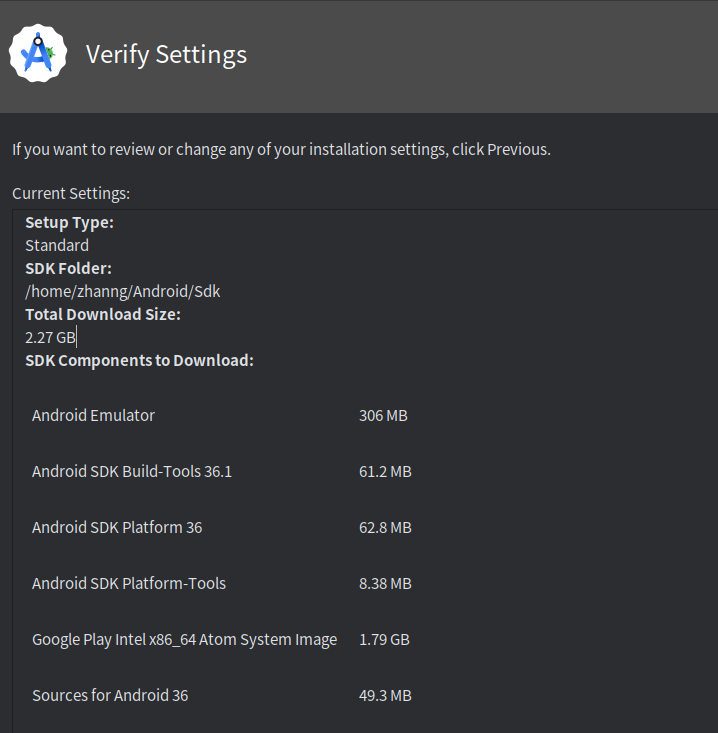

## 开发环境搭建

对于开发环境，需要下载下面的这些东西：

- Flutter SDK
- Android Studio，可以用作开发IDE, 也可以只是拿来下载Android SDK

下面以Vscode开发为例子:

1. 安装插件, 这里推荐的插件有:

   - Flutter
   - Dart
   - Flutter Widget Snippets

2. 配置Android开发环境.

   - 安装Android Studio, 安装Android SDK, 一般正常安装过程中就会有设置

3. 配置Flutter SDK
   ```shell
   sudo snap install flutter --classic
   ```

   为了确保依赖项的正常,一般使用
   ```shell
   Flutter doctor
   ```

   来检查所有的依赖项.在这里最后的结果是

   

## Demo测试

```shell
flutter create competition_demo
```
可以在当前文件夹下创建一个flutter项目。
项目结构如下：
```shell
competition_demo/
├── android/            <-- [平台适配] 安卓原生工程配置
├── build/              <-- [自动生成] 编译产物
├── ios/                <-- [平台适配] iOS原生配置
├── lib/                <-- [核心开发] 99%的代码都在这里！
│   └── main.dart       <-- 程序的入口文件
├── linux/              <-- [平台适配] Linux桌面端配置
├── test/               <-- [测试] 单元测试代码
├── web/                <-- [平台适配] Web端配置
├── windows/            <-- [平台适配] Windows桌面端配置
├── .gitignore          <-- [配置] Git忽略文件
├── analysis_options.yaml <-- [配置] 代码规范/Lint规则
├── pubspec.lock        <-- [配置] 锁定依赖版本
├── pubspec.yaml        <-- [配置] 项目的核心配置文件
└── README.md
```
后续的核心开发都在lib文件夹下进行。

在main.dart下可以通过f5运行
过程中可能会有两个问题
- Flutter 国内下载过慢
需要通过修改下载源来解决
- 下载到手机上出现报错, 这个与网络协议相关, 需要关闭电脑的VPN.
